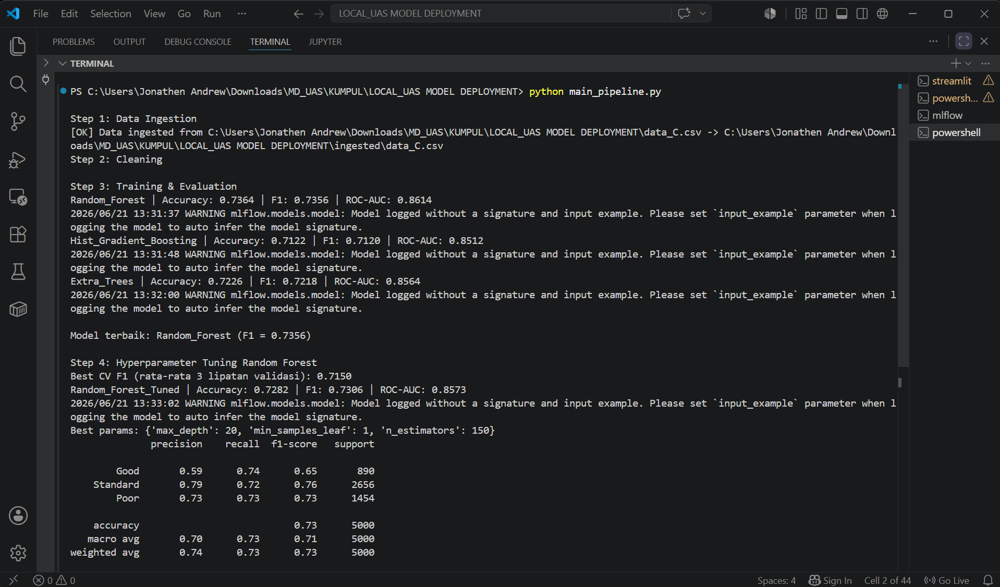
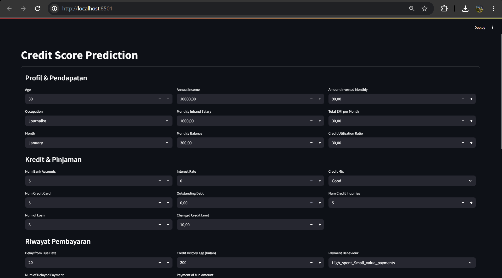
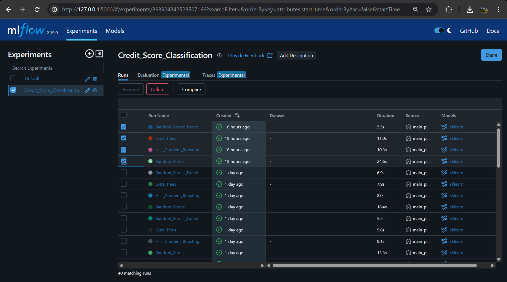
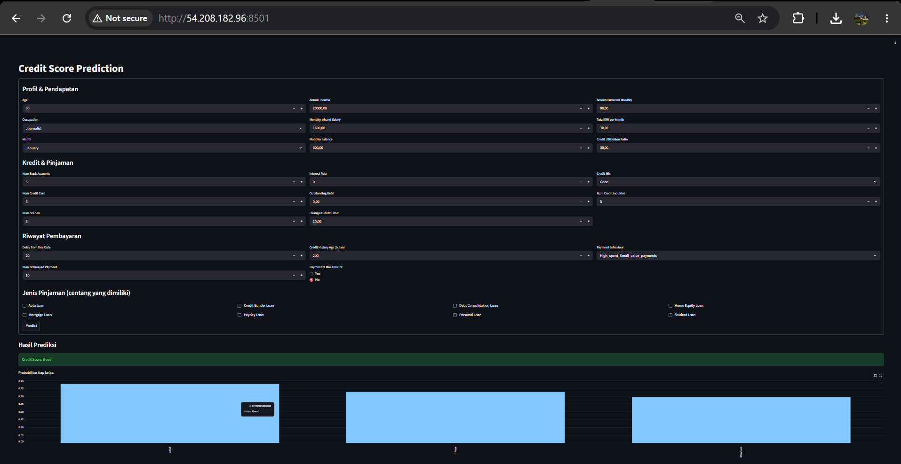

# Credit Score Classification: End-to-End ML Deployment

A machine learning pipeline that predicts whether a customer's credit score is Good, Standard, or Poor from their financial profile. It runs two ways: locally with an OOP training pipeline, MLflow tracking, and a Streamlit app, and on AWS with the same model served as a live SageMaker endpoint behind a Streamlit app on EC2.

I built it both ways on purpose, to see what actually changes when you move a model off your laptop and onto the cloud.



## Problem

Each customer has about 28 features: income, number of loans, delayed payments, credit utilization, credit history age, loan types, and so on. The task is to sort them into one of three credit-score classes. The classes are imbalanced, so I use stratified splits, class weighting, and weighted F1 as the main metric instead of plain accuracy.

## Dataset

The course-provided credit dataset (`src/data_C.csv`, ~100k rows). It comes in messy on purpose: numbers stored as strings, junk placeholders like `_______` and `!@9#%8`, impossible values such as negative loan counts and ages over 100, and a `Type_of_Loan` column that packs several loans into one cell. All of it gets cleaned in `src/preprocessing.py`.

## Approach

Cleaning is deterministic so nothing leaks from the test set:
- Drop IDs with no predictive value (`ID`, `Customer_ID`, `SSN`, `Name`).
- Turn string-typed numeric columns into floats and replace junk tokens with `NaN`.
- Mark impossible values (invalid negatives, out-of-range maxima) as `NaN` instead of dropping the whole row.
- Cap outliers at realistic domain limits rather than a blanket IQR rule.
- Split `Type_of_Loan` into 8 binary loan-type columns, where a missing value becomes all zeros.

Preprocessing runs through a `ColumnTransformer`: median imputation plus `StandardScaler` for numeric columns, ordinal encoding for `Credit_Mix` (Bad < Standard < Good, which has a real order), and one-hot for the remaining categoricals.

For modeling (`src/train_model.py`), an abstract `BaseModel` defines `train` and `predict`, and each subclass wraps one estimator. I compared three:

| Model | Notes |
|---|---|
| Random Forest | `class_weight='balanced'`, best performer |
| Hist Gradient Boosting | strong baseline |
| Extra Trees | `class_weight='balanced'` |

Random Forest won, so I tuned it with `GridSearchCV` over `n_estimators`, `max_depth`, and `min_samples_leaf`. The preprocessing sits inside the CV folds, so nothing leaks during tuning. Every run is logged to MLflow (params, accuracy, weighted F1, weighted ROC-AUC), and the final model and fitted preprocessor are saved to `artifacts/`.

## Results

The tuned Random Forest reaches a weighted F1 of about 0.73 on the held-out test set. Evaluation reports accuracy, weighted F1, and multi-class ROC-AUC (`src/evaluation.py`).

| Local Streamlit | MLflow runs |
|---|---|
|  |  |

## Local vs cloud

Local (`src/app.py`) loads the `.pkl` model and preprocessor straight from `artifacts/`. Setup is instant, it's free, and iteration is fast, but it does not scale and it leans on my laptop's specs.

Cloud (`aws/`) trains and hosts the model on AWS SageMaker as a real-time endpoint, with a Streamlit app on EC2 calling it through `boto3.invoke_endpoint`. It scales, and the pieces are decoupled, so the endpoint keeps running even if EC2 restarts. The downside is real cost and more setup: IAM roles, security groups, and so on.



One thing that tripped me up on the cloud side: the training environment has to pin `scikit-learn==1.4.2` to match the SageMaker `framework_version="1.4-2"` container, or the endpoint fails on a version mismatch. `aws/inference.py` holds the four SageMaker hooks (`model_fn`, `input_fn`, `predict_fn`, `output_fn`).

## Repository structure

```
credit-score-ml-deployment/
├── src/                    # local pipeline (run from here)
│   ├── data_ingestion.py
│   ├── preprocessing.py
│   ├── train_model.py
│   ├── evaluation.py
│   ├── main_pipeline.py    # entry point: trains, tunes, saves artifacts
│   ├── inference.py        # loads artifacts, single-customer prediction
│   ├── app.py              # local Streamlit app
│   ├── artifacts/          # trained model + fitted preprocessor (.pkl)
│   └── data_C.csv          # dataset
├── aws/                    # SageMaker endpoint + EC2 Streamlit deployment
│   ├── inference.py        # 4 SageMaker hooks
│   ├── deploy_endpoint.ipynb
│   ├── app_streamlit.py
│   └── user-data.sh        # EC2 startup (Streamlit via systemd)
├── notebook/exploration.ipynb
└── images/
```

## Running it locally

```bash
pip install -r requirements.txt
cd src

# train the pipeline (logs to MLflow, refreshes the .pkl artifacts)
python main_pipeline.py

# launch the app (the pre-trained artifacts are already included)
streamlit run app.py
```

To look through the experiments, run `mlflow ui` from `src/` and open `http://localhost:5000`.

## Tech stack

Python, scikit-learn, pandas, NumPy, MLflow, Streamlit, AWS SageMaker, EC2, boto3.
